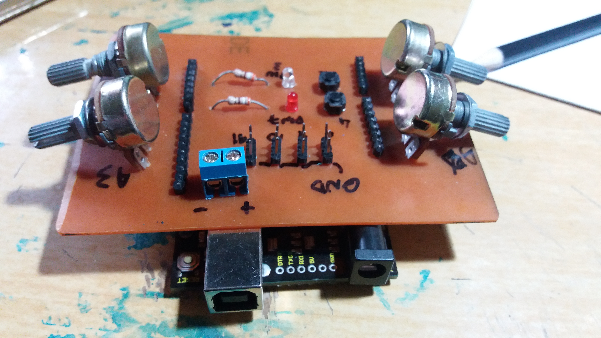
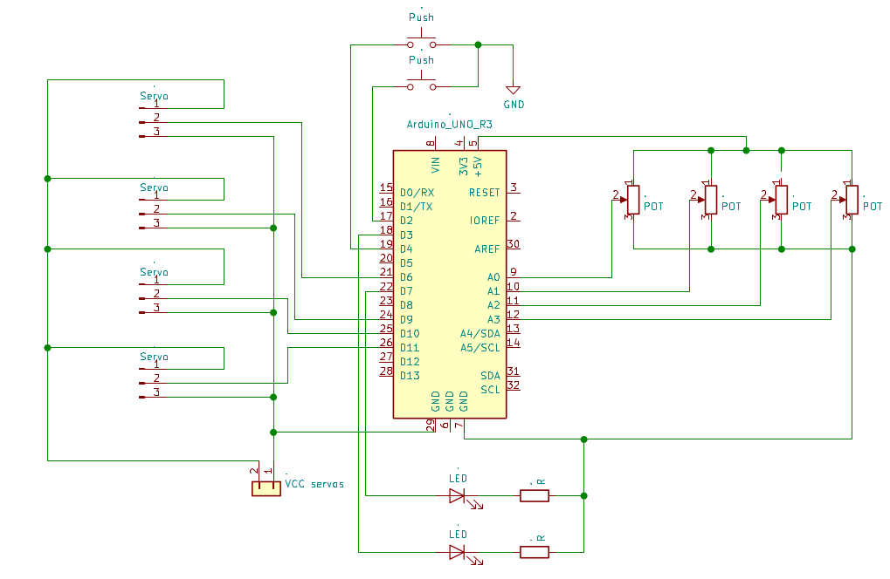

# Servo shield
Shield para servo motores em Arduino UNO R3

Trata-se de uma reprodução da PCB montada no vídeo a seguir: 

https://www.youtube.com/watch?v=vVOyWQZ25M8&

Anteriormente à realização desse documento, fiz a montagem da placa, porém, sem utilizar as footprints corretas, por meio do  software Kicad:




<h3>Esquemático</h3>




<h3>Teste</h3>

Foi utilizado o exemplo Knob, da biblioteca Servo, realizando algumas adaptações. 


```c

#include <Servo.h>

Servo servoA0;  // create servo object to control a servo
Servo servoA1;
Servo servoA2;
Servo servoA3;

int pot0 = A0;  // analog pin used to connect the potentiometer
int val0;    // variable to read the value from the analog pin

int pot1 = A1;  
int val1; 

int pot2 = A2;  
int val2; 

int pot3 = A3;  
int val3;
 
void setup() {
  servoA0.attach(6);  // attaches the servo on pin 9 to the servo object
  servoA1.attach(9);
  servoA2.attach(10);
  servoA3.attach(11);
}

void loop() {
  val0 = analogRead(pot0);            // reads the value of the potentiometer (value between 0 and 1023)
  val0 = map(val0, 0, 1023, 0, 180);     // scale it to use it with the servo (value between 0 and 180)
  servoA0.write(val0);                  // sets the servo position according to the scaled value
  
  val1 = analogRead(pot1);            
  val1 = map(val1, 0, 1023, 0, 180);     
  servoA1.write(val1);      

  val2 = analogRead(pot2);            
  val2 = map(val2, 0, 1023, 0, 180);     
  servoA2.write(val2);      

  val3 = analogRead(pot3);            
  val3 = map(val3, 0, 1023, 0, 180);     
  servoA3.write(val3);      
  
  delay(15);                           // waits for the servo to get there
}
```


A utilização dos botões ficará para outra oportunidade.
